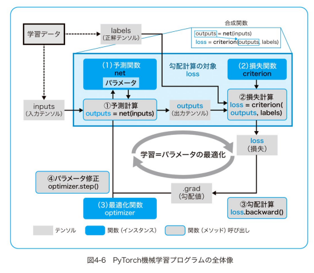
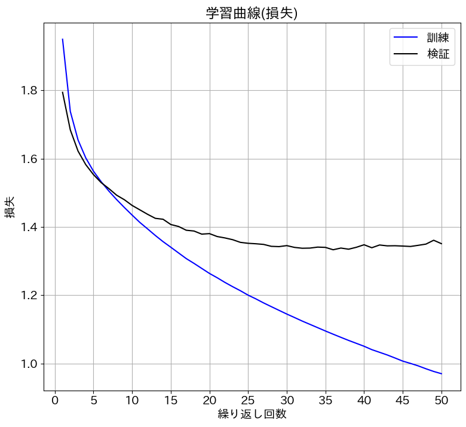
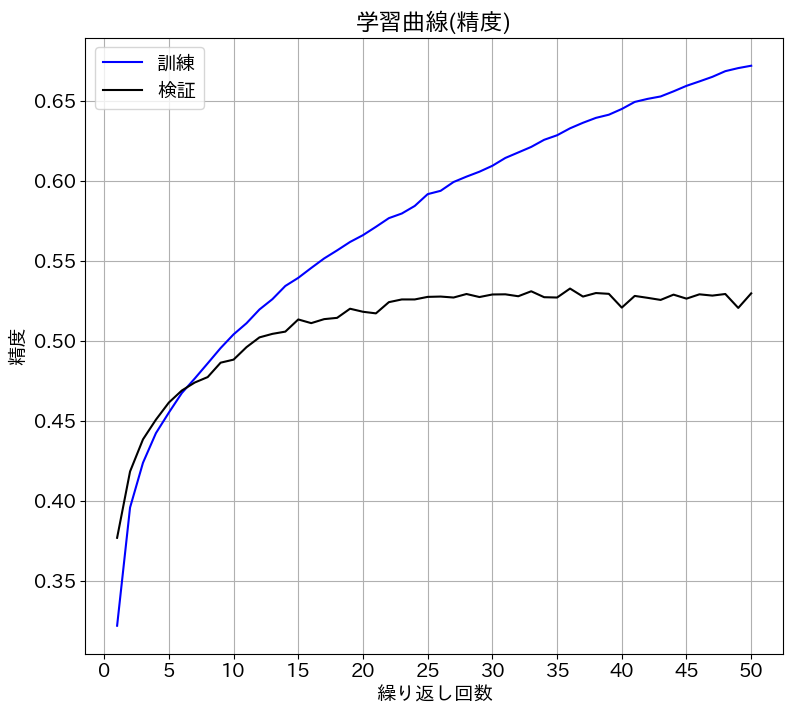
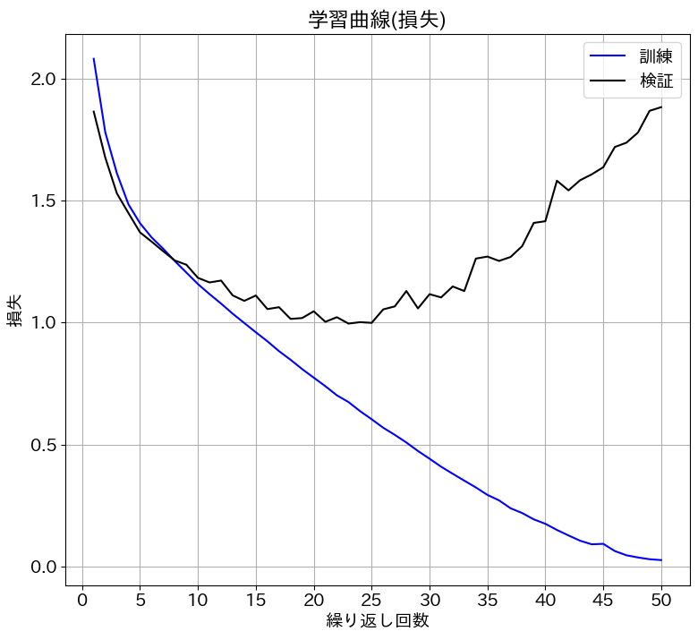
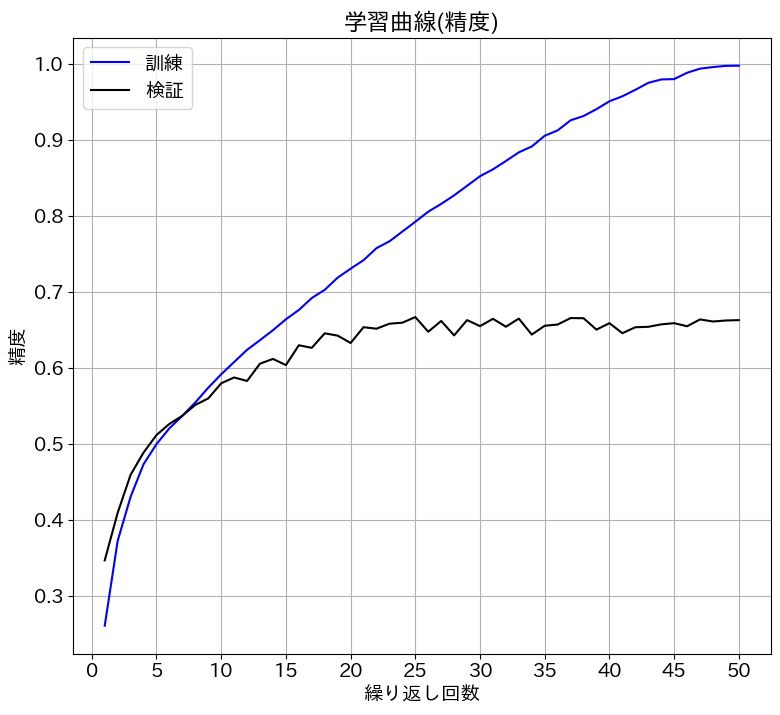

# Pytorch&深層学習プログラミング

- 書籍ソースコードサイト
    - https://github.com/makaishi2/pytorch_book_info
- 目次
    0. 初めての画像認識
    1. ディープラーニングのためのPythonのツボ
    2. Pytorchの基本機能
    3. 初めての機械学習
    4. 予測関数の定義
    5. 線形回帰
    6. 2値分類
    7. 多値分類
    8. MNISTを使った数字認識
    9. CNNによる画像認識
    10. チューニング技法
    11. 事前学習済みモデルの利用
    12. カスタムデータの画像分類

## 0. 初めての画像認識
## 1. ディープラーニングのためのPythonのツボ
## 2. Pytorchの基本機能

- 基本的な機能の確認
    - テンソルをいじくりまわした
    - 勾配計算をやった

## 3. 初めての機械学

- シンプルなデータセットで単回帰
- SGDでパラメータを更新するとこまでやった 

## 4. 予測関数の定義

大事そうな図だけメモ

## 5. 線形回帰

- カスタムモデルを使って予測器を実装
- 回帰における基本的な使い方

## 6. 2値分類

- 学習用と検証データの分割
- 過学習について
- シグモイド関数
- 交差エントロピー関数

## 7. 多値分類

- ソフトマックス関数

## 8. MNISTを使った数字認識

- MNISTを分類してみる
- 活性化関数にReLUを使う
- GPUを使ってみる

## 9. CNNによる画像認識

- CIFAR-10 (ML用の画像データセット)で，全結合DNNとCNNを学習し，精度を比較する

### 9-1. 全結合DNNの精度

- 検証データにおいては，30回以降は学習による精度向上が無い
- 検証データにおける精度は最大で53％くらい

### 9-2. CNNでの精度

- ↑のデータはRGB画像を1階テンソルで学習していたが，今回は3階テンソルとして持ち，CNNで学習する

 

- 損失を見ると，20回以降は過学習している
- 精度は6割超えなので上がってはいる

## 10. チューニング技法

- 9章のモデルを改善する
    - aaa
## 11. 事前学習済みモデルの利用
## 12. カスタムデータの画像分類